# Tizita Events (Ethiopia Event Photo Sharing Platform)

A private, QR-first collaborative event photo platform built for Ethiopia: **host creates event → pays in ETB (Chapa / telebirr) → shares QR → guests join without an account or app download → capture / upload → quarantine → validation + malware scan → derivatives → moderation → live gallery & venue slideshow → download/share → host export → closure → retention → deletion.**

Authoritative specification: *Ethiopia Event Photo Sharing Platform — Final Product, Feature, Architecture, Compliance and Launch Blueprint*. Everything here follows it; see [`docs/IMPLEMENTATION_MAP.md`](docs/IMPLEMENTATION_MAP.md) for the requirement → code map and [`docs/LEGAL_FLAGS.md`](docs/LEGAL_FLAGS.md) for the legal decisions that still need Ethiopian counsel.

---

## Visual Showcase & Screenshots

> 📸 For the full catalog of 64 screenshots across Web and Mobile, explore [`screenshots/README.md`](screenshots/README.md).

### 1. Guest Experience (Zero-App PWA)
Guests simply scan a table QR code or enter an 8-character event code. No app download or account creation required.

| Landing Page | Guest Invitation & Join | Guest Capture & Upload |
| :---: | :---: | :---: |
| 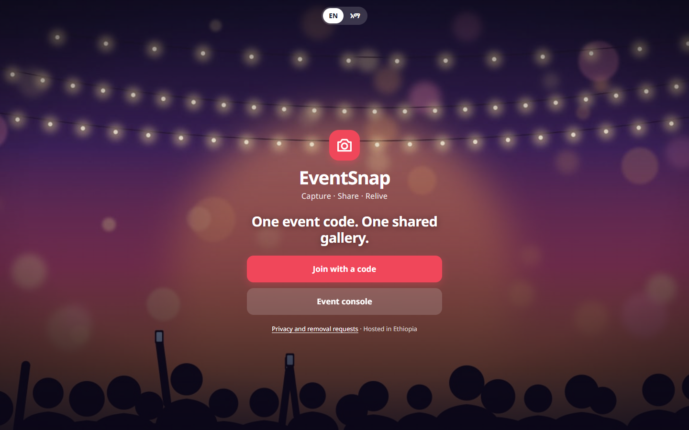 | 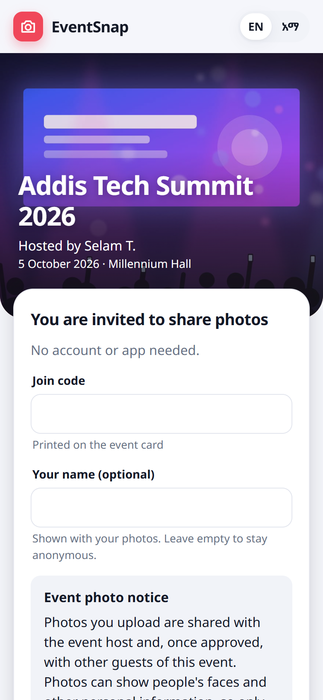 | 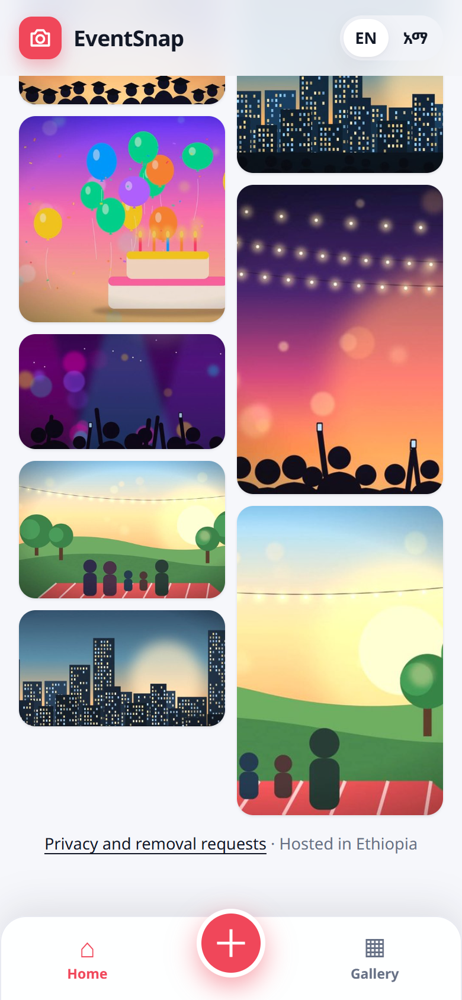 |

| Live Collaborative Gallery | Venue Live Slideshow | Amharic Localization (አማርኛ) |
| :---: | :---: | :---: |
| 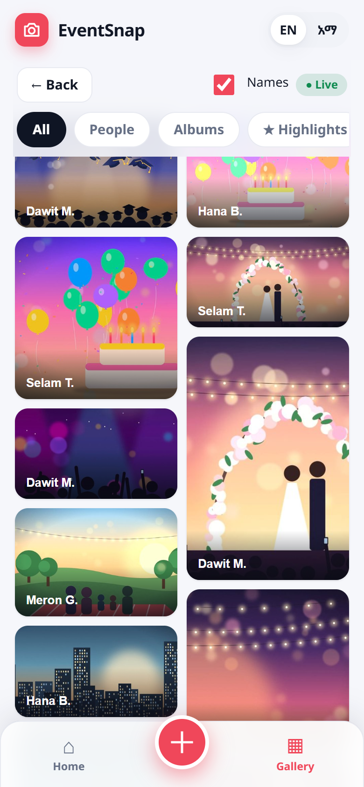 |  | 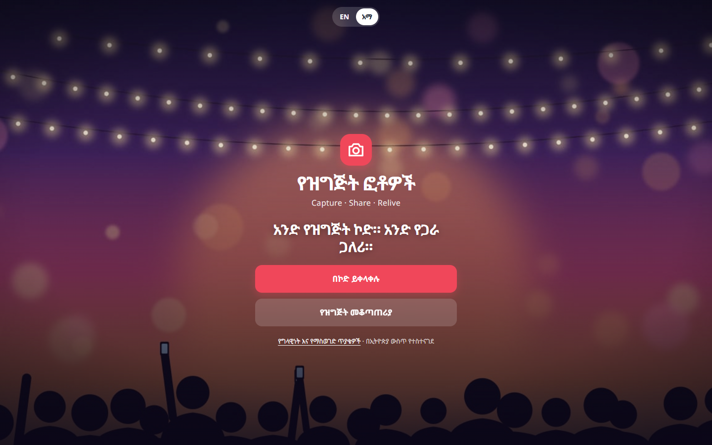 |

---

### 2. Host Console
Hosts manage event lifecycles, customize access rules, print branded QR codes, moderate submissions, and export full-resolution ZIP packages.

| Host Event Overview | Scoped QR Code Sharing | Live Moderation Queue |
| :---: | :---: | :---: |
| 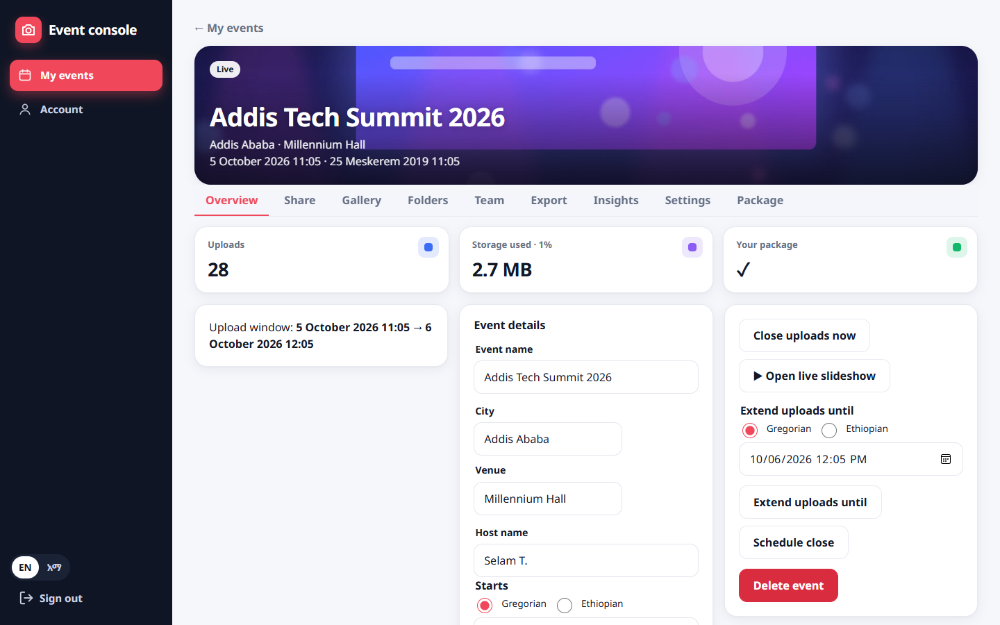 | 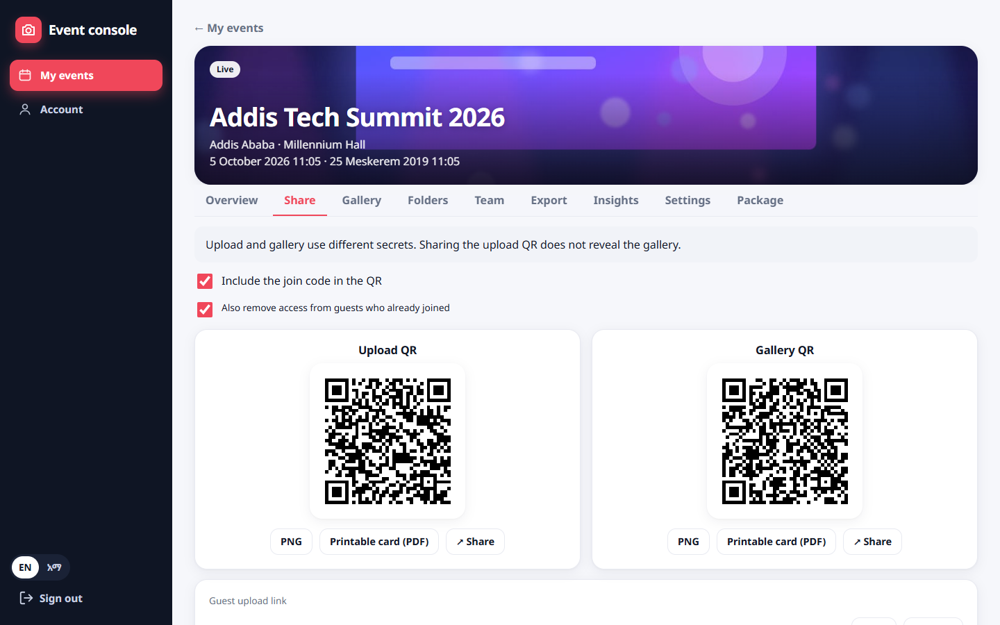 | 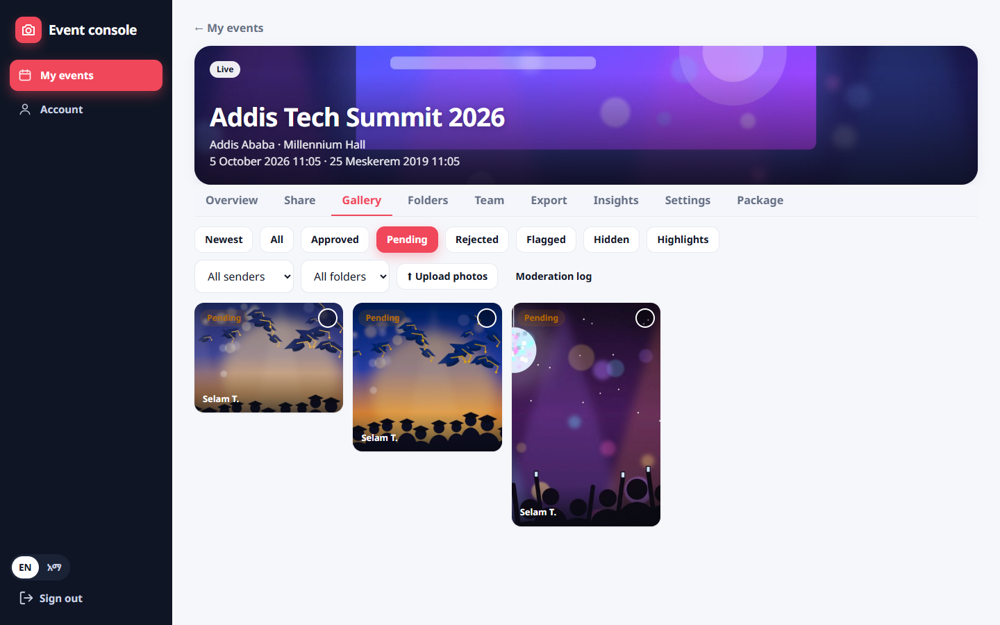 |

---

### 3. Android Companion App (Flutter)
Camera-first capture companion with persistent background upload queue, offline resilience, and Wi-Fi sync.

| Camera Capture | Background Upload Queue | Mobile Gallery Grid |
| :---: | :---: | :---: |
| 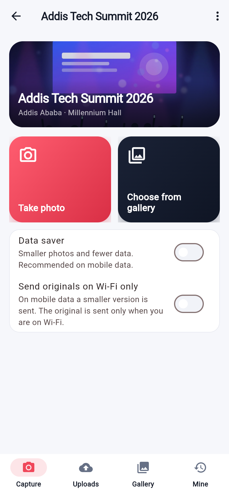 | 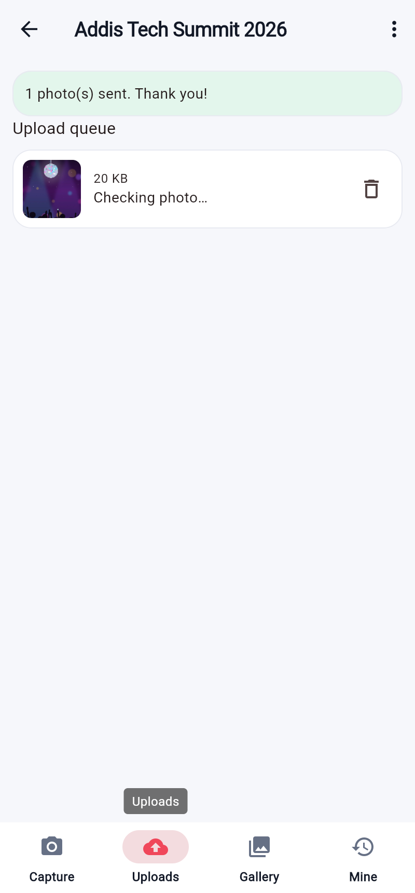 | 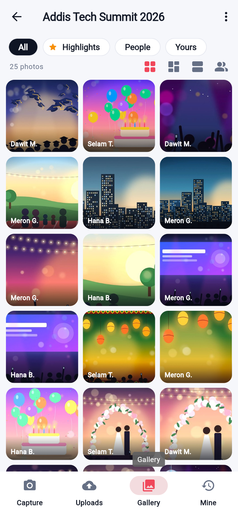 |

---

### 4. Platform Administration & Compliance
Platform management, storage quotas, audit trails, and data sovereignty compliance.

| Admin Dashboard | Compliance & Retention Purge | Audit Log |
| :---: | :---: | :---: |
| 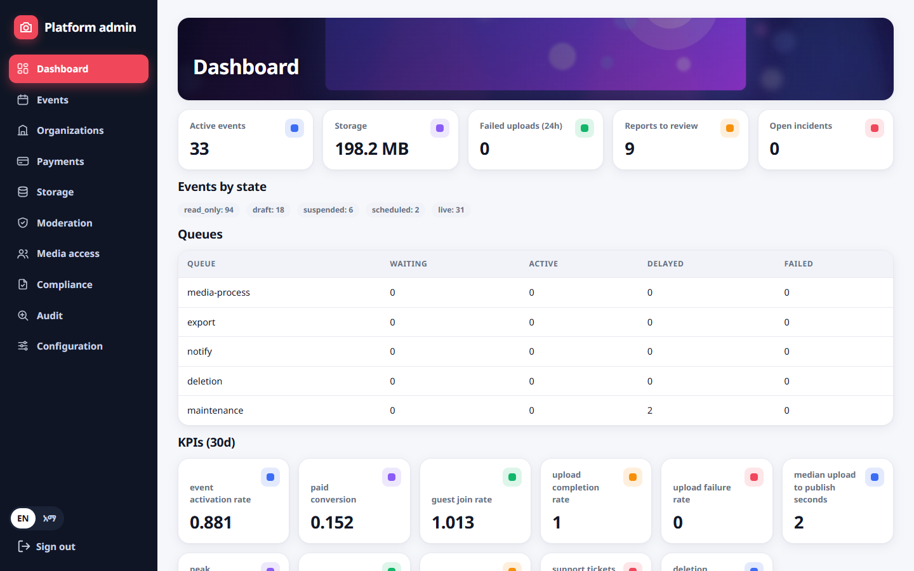 | 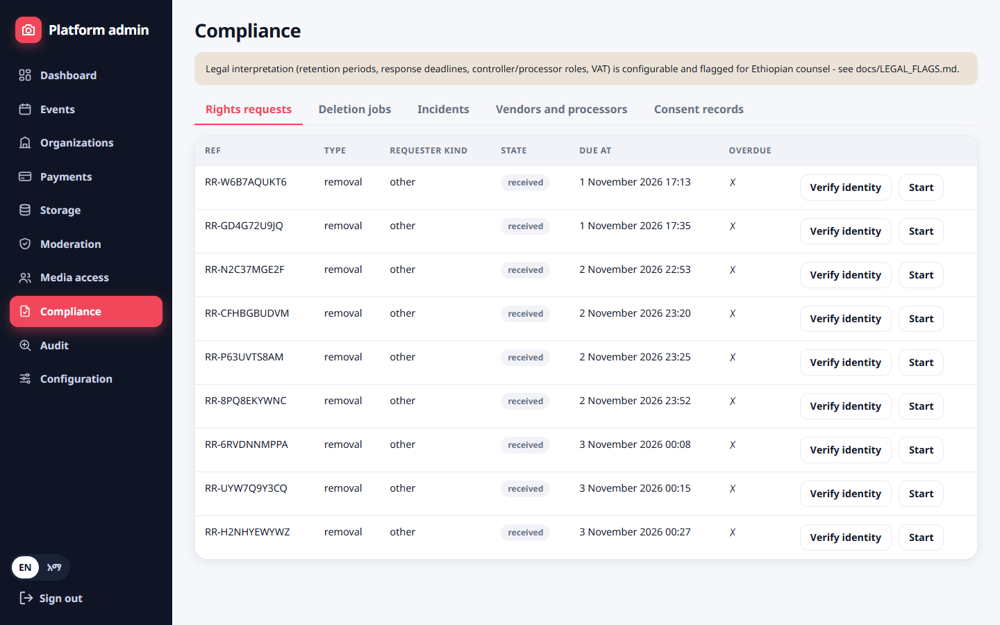 | 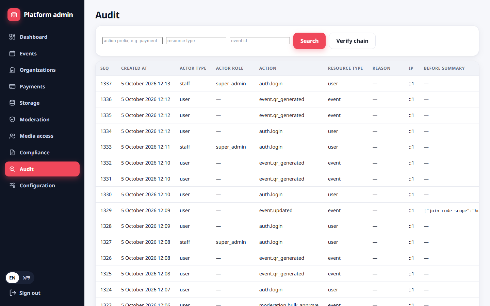 |

---

## Monorepo Architecture

```
apps/api      NestJS + PostgreSQL + Redis/BullMQ + S3(MinIO) + sharp/libvips + ClamAV  (API, workers, scheduler)
apps/web      Next.js: guest PWA (/j/…), host console (/host), platform admin (/admin), EN + አማርኛ
apps/mobile   Flutter Android app: camera-first capture, persistent resumable queue, Wi-Fi-only originals, deep links
infra         docker-compose, nginx, Prometheus/Grafana, backup + restore-drill scripts
docs          architecture, API, database, deployment, testing, legal flags, decisions, implementation map
screenshots   High-resolution UI captures of Guest, Host, Admin, and Android apps
```

## Quick Start

```bash
cp .env.example .env
docker compose -f infra/docker-compose.yml --env-file .env up -d        # Postgres, Redis, MinIO
cd apps/api && npm install && npm run migrate && npm run seed && npm run start:dev      # :4000
cd apps/web && npm install && npm run dev                                                # :3000  (-p 3100 if 3000 is busy)
# Android: cd apps/mobile && flutter pub get && flutter run --dart-define=API_BASE=http://10.0.2.2:4000
```

Dev conveniences (local `.env` only; refused in production): `OTP_FIXED_CODE=123456`, `SMS_PROVIDERS=console`, `PAYMENT_PROVIDER=sandbox`, `AV_MODE=eicar`. Full instructions: [`docs/DEPLOYMENT.md`](docs/DEPLOYMENT.md).

## Verification & Testing

```bash
cd apps/api && npm run test:unit && npm run test:integration && npm run test:e2e      # needs the compose services
cd apps/web && npm test                                                              # i18n, calendar, upload engine
cd apps/web && WEB_URL=http://localhost:3100 npx playwright test                     # real-browser guest/host/admin flows
cd apps/mobile && flutter test                                                       # upload engine, deep links, sessions, l10n
```

Test counts, the 30 acceptance criteria and what still needs a real-network pilot: [`docs/TESTING.md`](docs/TESTING.md).

## Non-negotiables (enforced in code, not just policy)

* Guests need **no account and no app**; sessions are short-lived and signed; **upload and gallery use different secrets**.
* Photos pass quarantine → magic-byte check → malware scan (fail-closed) → decode safety → EXIF/GPS-stripped derivatives; originals are plan-controlled and never public.
* **No facial recognition / biometrics**, no foreign AI/CDN/cloud; production refuses to boot with non-Ethiopian endpoints or dev secrets.
* Payments activate **only after provider verification**; callbacks are signature-checked, idempotent, and never trusted alone; refunds are never faked.
* Authorization is server-side on every route (default-deny); staff cannot browse private media without a four-eyes, time-boxed, audited grant; admin has mandatory 2FA and step-up for risky actions; audit log is append-only and hash-chained.
* Lifecycle, retention, deletion and legal hold are real backend state machines with evidence.

## License

This project is licensed under the MIT License - see the [LICENSE](LICENSE) file for details.
